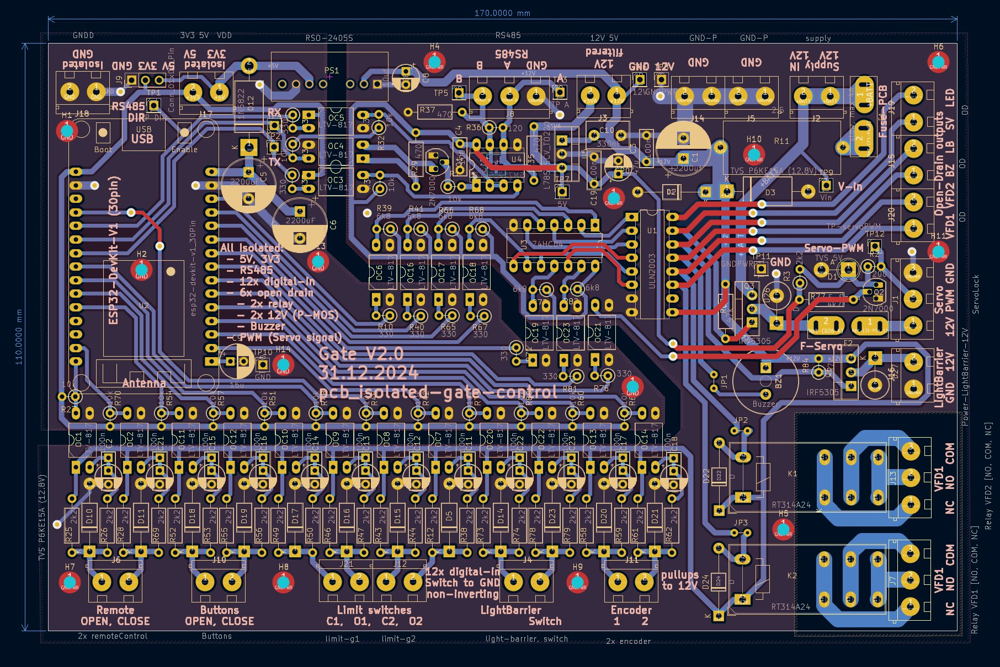
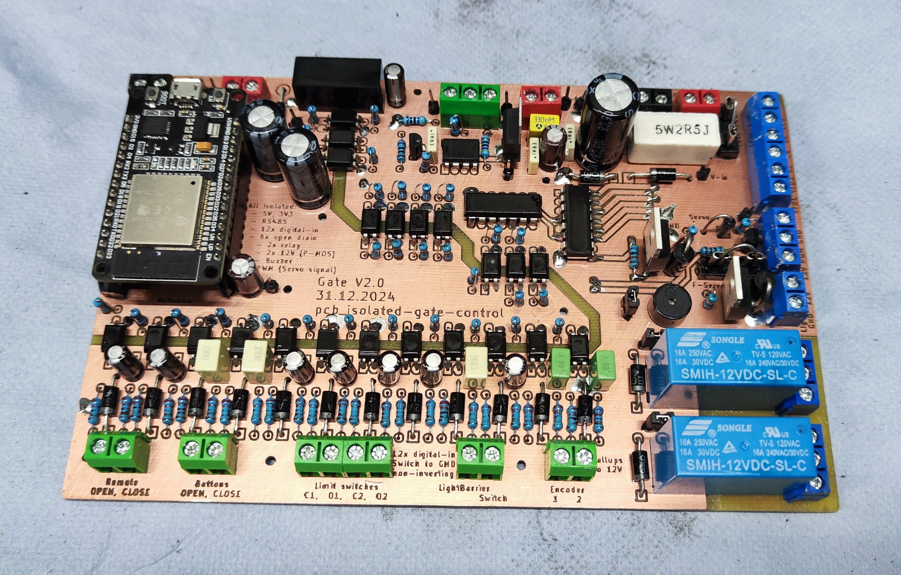
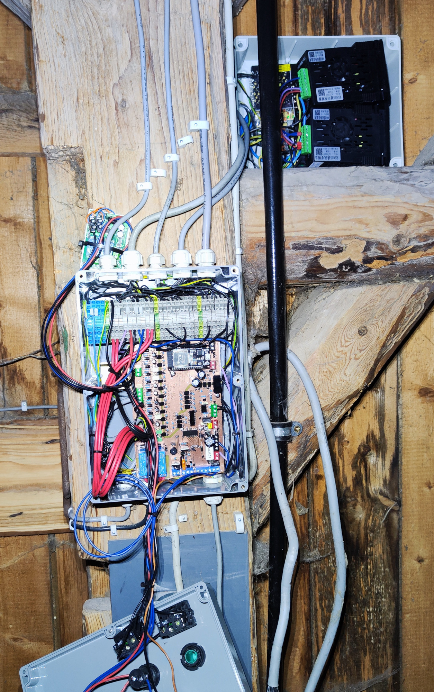
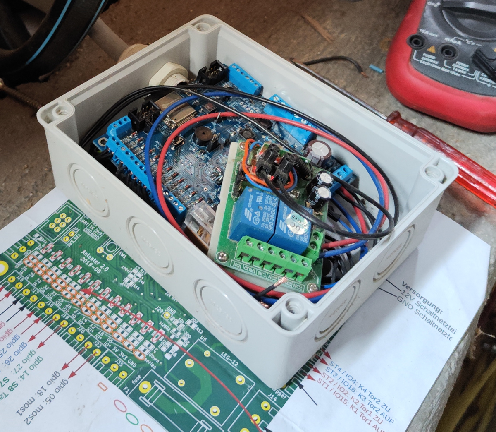
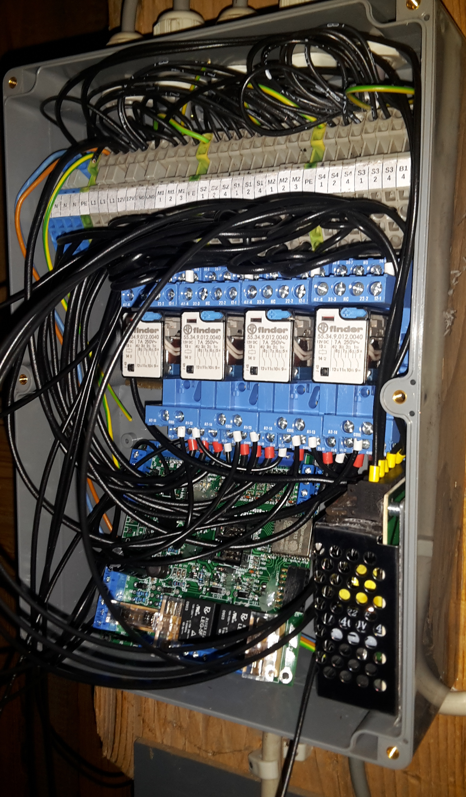
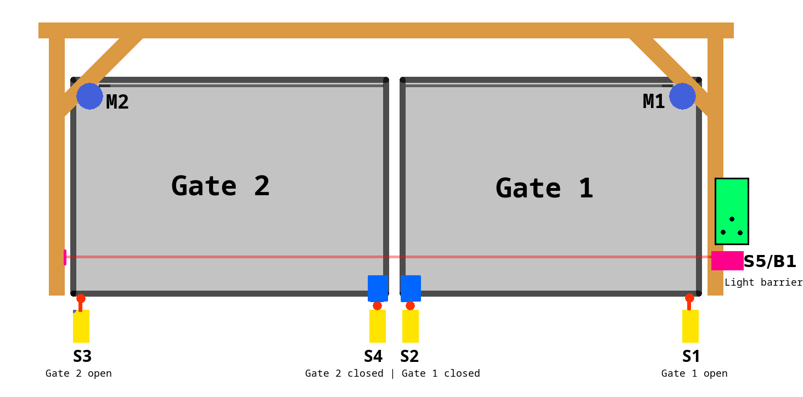

Custom pcb-design and firmware for an esp32 controlling a self-made automated sliding gate.  
Full Documentation: https://pfusch.zone/automated-sliding-gate


# Changelog V2.0
- Replace old multipurpose board with a custom pcb for controlling the gate
- custom pcb:
  - fully isolate microcontroller from long cables and VFD noise
  - RS485 interface
  - Servo interface to lock the gate
  - Preparation for Encoders
- control motors with VFDs instead of Relays
- firmware rework or rewrite

<br>

## pcb v2.0-isolated-gate-control
- **[KiCad Project](pcb_v2.0-isolated-gate-control/)**
- **[Schematic.pdf](pcb_v2.0-isolated-gate-control/export/schematic.pdf)**
- **[G-code for Isolation Milling](pcb_v2.0-isolated-gate-control/pcb2gcode)**  
  
- **[Connection plan](doc/V2.0_connection-plan.drawio.pdf)**

Schematic + layout preview:  
<p align="center">
  <a href="pcb_v2.0-isolated-gate-control/export/schematic.pdf">
    
  </a>
  
</p>

  
<br>

## Photos
Photos of the V2.0 hardware setup (new custom made pcb, control cabinet and additional box with outsourced power supply and VFDs)
<p align="center">
  
  
</p>


<br>


# Installation
### Install esp-idf
For this project **ESP-IDF v5.5.1** is required  
(with other versions it most likely will not compile)
```bash
#clone the esp-idf repository and check out the required version
git clone -b v5.5.1 --recursive https://github.com/espressif/esp-idf.git ~/esp/v5.5.1/esp-idf
#run installation script in the cloned folder
~/esp/v5.5.1/esp-idf/install.sh esp32
```
### Clone this repo
```
git clone git@github.com:Jonny999999/gate_fw.git
```

# Compilation
### Set up environment
```bash
source ~/esp/v5.5.1/esp-idf/export.sh
```
(run once per terminal)

### Compile
```bash
idf.py build
```

### Upload
**Important:** Since V2.0 the **east Gate has to be slightly open for the upload to work**  
(Since the gpio used for limit switch fully closed has to be pulled low during flashing)
- connect micro-usb cable to ESP32 module on pcb
- press REST and BOOT button
- release RESET button (keep pressing boot)
- run flash command:
```bash
idf.py flash
```
- once "connecting...' successfully, BOOT button can be released  


# Usage

All gestures are on the **open button** unless noted otherwise. The buzzer confirms every
one of them, so the gate can be operated without looking at it.

| Gesture | Result | Sound |
|---|---|---|
| **Open button, short press** | opens a small gap (~1.9 s of travel) | one short beep |
| **Open button, press again** (while it is still waiting) | widens the gap by ~0.7 s per press | one very short beep per press |
| **Open button, press and keep holding** | opens completely | one long tone |
| **Open button: short press, then press and hold** | opens the small gap and **closes again by itself** after 20 s | one long tone, then two short ones |
| **Close button** or **remote B** | closes completely | one long tone |
| **Remote A** | opens completely | one long tone |
| **Any button while a gate moves** | stops the movement | one medium tone |

The gate distinguishes "hold from the start" (open completely) from "short press, release,
then hold" (open a gap and close behind me) - so the familiar full-open gesture is unchanged.

### Let me through, then close behind me
Short press, then press and hold. The gate opens the small gap, waits 20 seconds and closes
again on its own.

- An accelerating beep countdown announces the closing, the same one the gate uses whenever
  it starts moving by itself.
- While the light barrier is interrupted the 20 seconds start over, so it never begins to
  close while somebody is still standing in the gap.
- Pressing **open** cancels it and leaves the gate open (two short beeps, then a long one).
  Pressing **close** closes immediately instead of waiting.
- The fault LED gives a short flash once per second while an automatic close is pending.

### Fault LED
The red LED keeps showing the last problem until the next movement is started. The blink
rate says how serious it is - the faster, the more attention it needs:

| Blink rate | Meaning |
|---|---|
| very fast (10/s) | VFD communication failed - the drives could not be reached |
| fast (2.5/s) | movement timeout - a limit switch was not reached in time |
| slow (1/s) | motor current too high - something was in the way while closing |
| very slow (0.5/s) | the light barrier stayed blocked, the movement was given up |
| short flash, long gap | no fault: an automatic close is pending |
| steady on (while idle) | no fault: the light barrier is interrupted (useful for aligning it) |

The green panel LED is wired in parallel with the buzzer and simply echoes the beeps.

<br>

---

# Legacy -  Old Version V1.0
Left: Photo of control-pcb + RC-module (V1.0)  
Right: Photo of cabinet with power relays and V0.1 board (in V1.0 new board version was used and outsourced due to EMV issues when switching)
<p align="center">
  
  
</p>

# Schema
